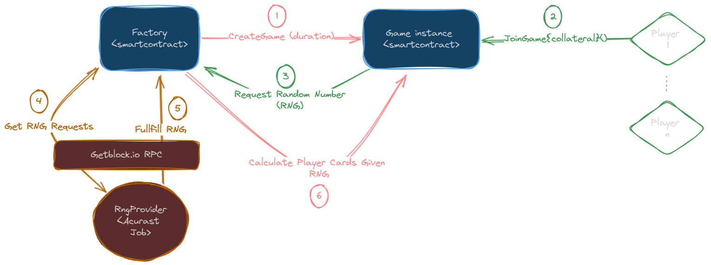

# [Random Open] Restricted RPS

**TLDR;** A Prouvably fair multiplayer Card Game based on Rock Paper Scissors. Players join by providing a collateral and recieve <em>6 random cards</em> (a collection of Rock, Paper, Scissors cards) and <em>3 stars</em>. Players play matches by chosing a card and betting a number of stars. At the end of the game, if a player has no more cards, he can redeem his stars for collateral. The fairness of the game is proven by the blockchain and any cheating is automatically detected.

**Disclamer:** The previous version of this game [https://github.com/raouf2ouf/restricted-rps](https://github.com/raouf2ouf/restricted-rps) won the second best project at the [Encode x Lightlink Hackathon]() and the new verson is submitted to the Encode x Polkadot Hackathon 24Q1. Details on the changes can be found [here](#changes-for-the-encode-x-polkadot-hackathon).

## Links

- Live demo [restricted-rps.com]()
- Demonstration video [Demo Video]()
- Pitch Deck [Slides Presentation]()

## Table Of Content

- [Changes for the Polkadot hackathon](#changes-for-the-encode-x-polkadot-hackathon)
- [Game Introduction and How to Play](#game-introduction-and-how-to-play)
- [Architecture and How it Works](#architecture-and-how-it-works)
- [Known Issues](#known-issues)
- [Roadmap](#roadmap)

## Changes for the Encode x Polkadot Hackathon

The previous version of this game submitted for the Encode x LightLink hackathon (won second best project) had various shortcommings pointed out by the judges, mainly, **scaling**. In the new version, we use **Acurast.com** and **GetBlock.io** to address these weaknesses. The following table explains the main changes:

| Changes                     | Previous version [(github repo)](https://github.com/raouf2ouf/restricted-rps)                                                                                                                                                                                                                                                                                                                                                                                                                                                                                                                                                                                                                                                                                                                                                                                                                                                       | Polkadot version                                                                                                                                                                                                                                                                                                                                                                                                                                                                                                                                                                                                                                                                                                                                                                                                                                                                                                                                                                                                      |
| :-------------------------- | :---------------------------------------------------------------------------------------------------------------------------------------------------------------------------------------------------------------------------------------------------------------------------------------------------------------------------------------------------------------------------------------------------------------------------------------------------------------------------------------------------------------------------------------------------------------------------------------------------------------------------------------------------------------------------------------------------------------------------------------------------------------------------------------------------------------------------------------------------------------------------------------------------------------------------------- | :-------------------------------------------------------------------------------------------------------------------------------------------------------------------------------------------------------------------------------------------------------------------------------------------------------------------------------------------------------------------------------------------------------------------------------------------------------------------------------------------------------------------------------------------------------------------------------------------------------------------------------------------------------------------------------------------------------------------------------------------------------------------------------------------------------------------------------------------------------------------------------------------------------------------------------------------------------------------------------------------------------------------- |
| Technology                  | <ul><li>**Frontend:** Ionic / Wagmi</li><li>**Backend:** Nest (Nodejs)</li><li>**Contracts:** Foundry (Solidity)</li></ul>                                                                                                                                                                                                                                                                                                                                                                                                                                                                                                                                                                                                                                                                                                                                                                                                          | <ul><li>**Frontend:** Next.js / Wagmi / Inkathon</li><li>**Backend:** n/a</li><li>**Contracts:** Foundry (Solidity) / Ink</li></ul>                                                                                                                                                                                                                                                                                                                                                                                                                                                                                                                                                                                                                                                                                                                                                                                                                                                                                   |
| Architecture                | **Client-Server**  A server is needed for automatic game creation, cards distribution, game closing, and distribution of player rewards. This Nodejs server relies on multiple Etherjs listeners.  **Main issues:** <ol><li><u>_Reliability:</u>_ The server fails regularly due to too many RPC http calls (for listeners) and too many submitted transactions at the same time.</li><li><u>_Trust_:</u> while the game is desined to eliminate the need for trusted third party, players need a minimum level of trust towards the server as its computations are not publically verifiable (initial deck generation, cards given to players) [even if any cheating done by the server will be publically detected at the end of game].</li><li><u>_Blockchain support:_</u> the server was already struggling listening to one blockchain, it needs a complete redesign for it to support multiple blockchains.</li></ol> | **Serverless and fully decentrelized**  With the help of _Acurast_ cloud computing, a server is no longer needed, making the game 100% decentralised. **Solutions:**<ul><li><u>_Reliability:_</u> with the use of multiple Acurast Jobs that start at different intervals, we can realiably automate the various tasks that a game needs. Furthermore, with the use of Getblock websocket RPCs we can limite the execution time of these jobs to 1-2 seconds at most.</li><li><u>_Trust:_</u> with the change from hidden cards to open cards (see game design for more info), players no longer need to trust a thrid party (they will need to trust Acurast Rng numbers but that is a given).</li><li><u>_Blockchain support:_</u> Now that the source of rng and automatisation is Acurast jobs, we can serve any EVM or Substrate chains. We currently have 8 jobs total: 4 jobs handle player Rng for EVM and Substrate, and 4 jobs that handle automatic game closing and reward destribution.</li></ul> |
| Scaling Games               | <ul><li>Max nbr Players per Game: **6**</li><li>Max total simultanious Players: **60**</li><li>Nbr of Game Factories: **1**</li></ul>                                                                                                                                                                                                                                                                                                                                                                                                                                                                                                                                                                                                                                                                                                                                                                                               | <ul><li>Max nbr Players per Game: **20** (achieved by changing deck representation)</li><li>Max total simultanious Players (same chain): **+400** (achieved by using multiple acurast jobs)</li><li>Nbr of Game Factories: **5** (1 per blockchain) (achieved by using multiple Getblock rpc endpoints combined with multiple acurast jobs)</li></ul>                                                                                                                                                                                                                                                                                                                                                                                                                                                                                                                                                                                                                                                                 |
| Scaling RPC calls           | The game requires more than 50 RPC calls per second. Furthermore, any lag on contract event listener can negatively impact the ability of players to make the right choice of cards. The handling of contracts event was not optimised along with the inability of the RPC to respond quickly.                                                                                                                                                                                                                                                                                                                                                                                                                                                                                                                                                                                                                                      | By using multiple Getblock.io websocket RPC and optimising RPC calls (40 calls per second per game) we achieve fluid gameplay.                                                                                                                                                                                                                                                                                                                                                                                                                                                                                                                                                                                                                                                                                                                                                                                                                                                                                        |
| Scaling Blockchains support | In this version, only 1 blockchain (LightLink) was supported.                                                                                                                                                                                                                                                                                                                                                                                                                                                                                                                                                                                                                                                                                                                                                                                                                                                                       | By using Acurast as a chain-agnostic RNG provider along with Getblock RPCs we can support multiple evm and polkadot chains. Currently, we deployed the game for: Fantom Testnet, Azero Testnet, Polygon Mumbai, LightLink Testnet. Furthermore, deploying to a new blockchain is relatively straightforward as it only requires creating a Getblock RPC API keys and Acurast Jobs (along with integrating the proper wallet on the frontend).                                                                                                                                                                                                                                                                                                                                                                                                                                                                                                                                                                         |

## Game Introduction and How to Play

### Introduction

[Rock, Paper, Scissors [RPS]]("https://en.wikipedia.org/wiki/Rock_paper_scissors) is one the most iconic and played games all over the world
(there is even an [RPS World Championship](https://wrpsa.com/rock-paper-scissors-tournaments/). However, there was always a debate on wether it is a game of <em>chance</em> or a game of <em>skill</em> ?

<em>Random Open Restricted RPS</em> [RORRPS] is a variant that adds complexity and amplifies the role of chance and skill. It is inspired by the famous [Resctricted RPS](https://kaiji.fandom.com/wiki/Restricted_Rock_Paper_Scissors) from the manga [Kaiji](https://kaiji.fandom.com/wiki/Kaiji_Wiki) along with the [E-Card](https://kaiji.fandom.com/wiki/E-Card) game from the same manga. By making the player cards public, chosing a card amounts to playing E-Card.

### How to play

You start by joining a game and providing a <em>collateral</em> for which you will recieve:

- <em>6 cards: </em> a collection of Rock, Paper, Scissors cards.
- <em>3 stars: </em> used to bet when you play a card. They are redeemable for collateral at the end of the game.
- ~~<em>In-game Cash: </em> used to buy and sell cards. You can only redeem stars if you have no cards in you hand!~~ (functionnality removed for now as the smart-contract is too big).

After which you can <em>offer</em> or <em>answer</em> a match: a match is offered by placing a hidden card and a bet (number of stars). Other players can answer your match by placing a card and bet at least equal to the minimum you indicated.

### How to win [or lose]

- You <em>win a game</em> when you have <em>at least 3 stars </em> and <em>no cards</em> at the end of the game. For each star above 3 you will recieve additional collateral.
- You <em>lose a game </em> when you have <em>less than 3 stars</em> at the end of the game (you will still recieve part of your collateral for each star you have).
- You <em>draw a game</em> when you have more than 3 stars and at <em>least 1 card</em>. You will only recieve the collateral you used.

## Architecture and How it Works

The game is composed of two smart-contract:

- `RestrictedRPSFactory`: handles game creation (deploys or resets an instance of the `RestrictedRPSGame` contract), collateral redeeming, and banning of cheaters.
- `RestrictedRPSGame`: handles everything related to a game, from joining to matches along with cheat detection.

Along with these smart contract, there is a frontend to simplify contract interaction and a set of Acurast jobs that handle automation and Rng providing.

The following schemas describes how Acurast and Getblock are using to generate the Cards of a player:

## Known Issues

- <u>**Acurast HttpPOST:**</u> There is currently an issue with Acurast Jobs, the `HttpPost` method sends a `GET` request rather than a `POST` request. this makes the job unabled to have up-to-date information on players to give the correct `RNG`. A workaround is currently in place only for `Fantom Testnet` as getting the gas fees is relatively easy for this chain.

## Roadmap

This project (previous and current version) was started 4 weeks ago (mid february 2024). There is sill a lot of work to bring this game to the public, mainly:

- **2024Q2**:
  - Optimise frontend wallet connection: the blockchain change detection is currently unreliable.
  - Optimise Ink Smart Contracts: My knowledge of Ink is still limited, I believe the smart contract can be better optimized.
  - Deploy more Acurast Jobs and have a dedicated smartphone for our jobs.
  - Improve the reliability of the winning/loss aggregated data for players.
- **2024Q3/4**:
  - Public launch with Tournaments including prizes and NFTs.
  - Include Partners from Web3 and from the RPS community.
